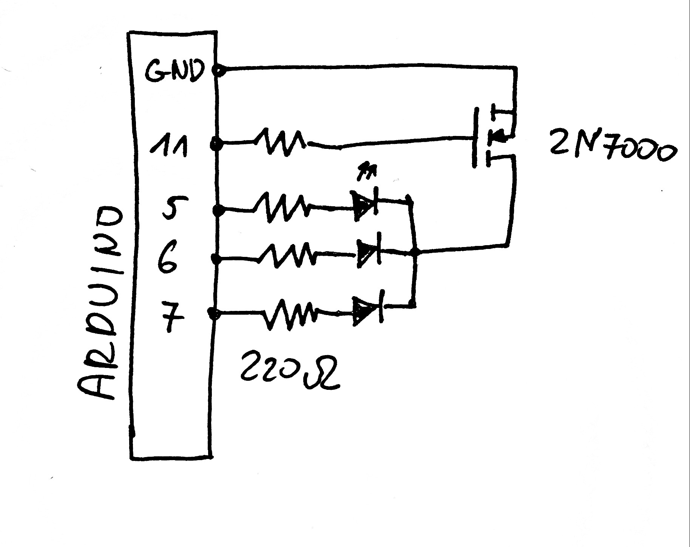

# roombaDIYDockStation
DIY docking and charging station for roomba (tested with model 650)
STL files : https://www.thingiverse.com/thing:4685245

Roomba needs 22V with current limit 1.5A to charge correctly. 

**Problems:
- Roomba can't undock. Probably because charger needs to lower the volatge to 5V before undocking 
